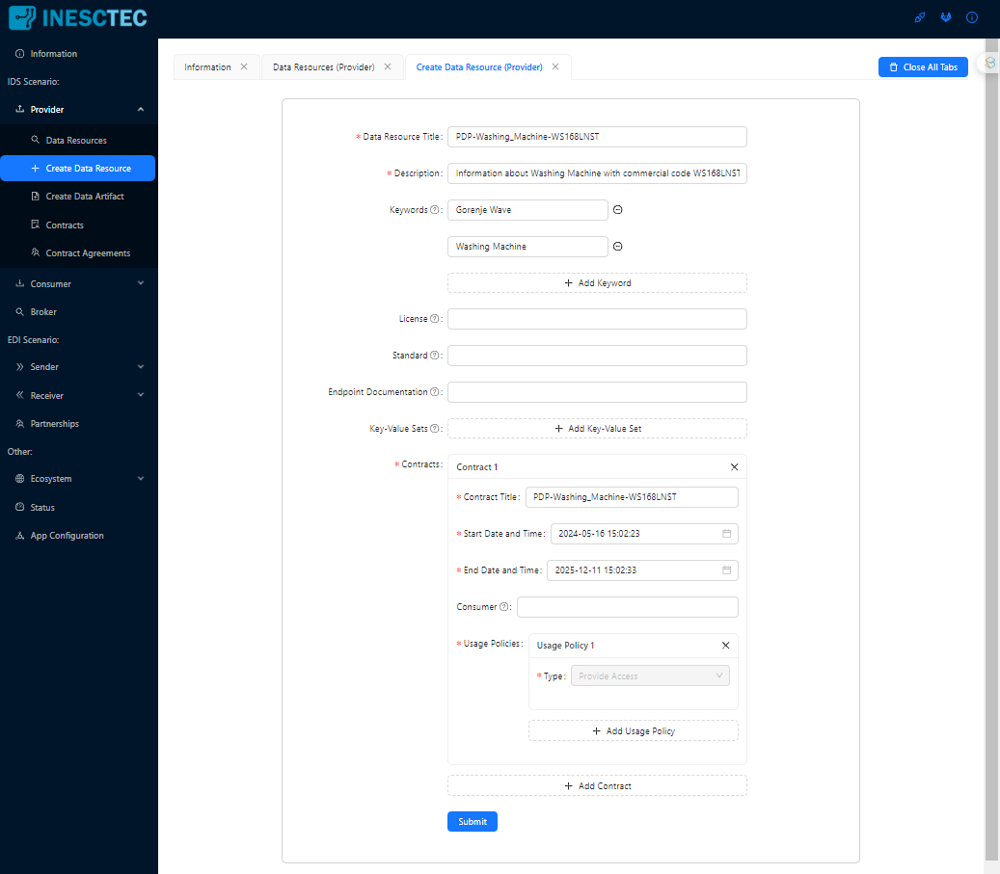
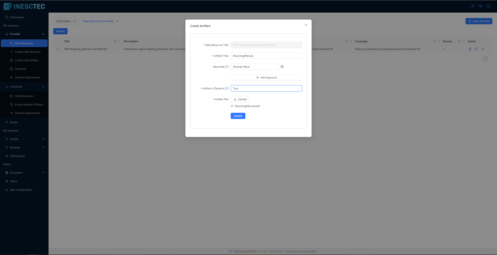
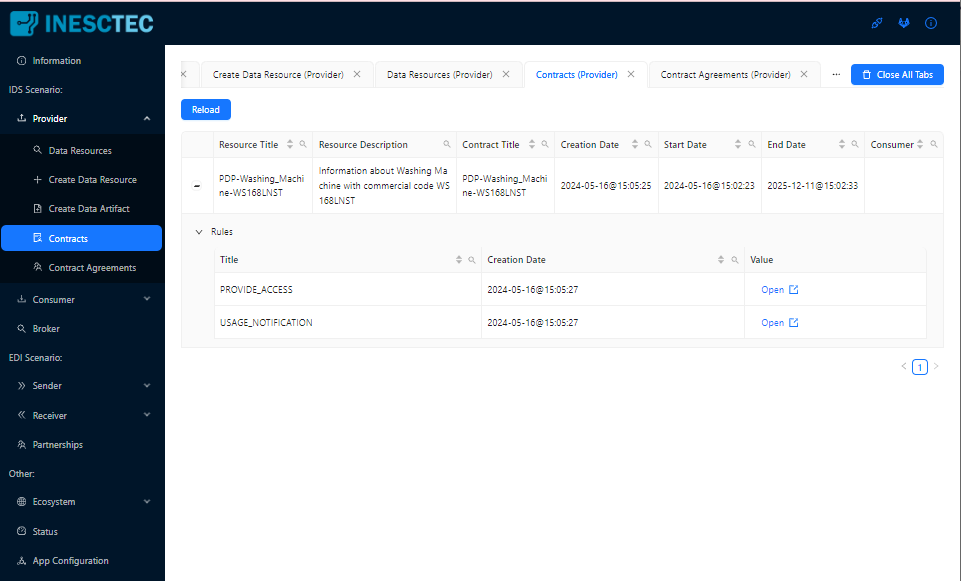
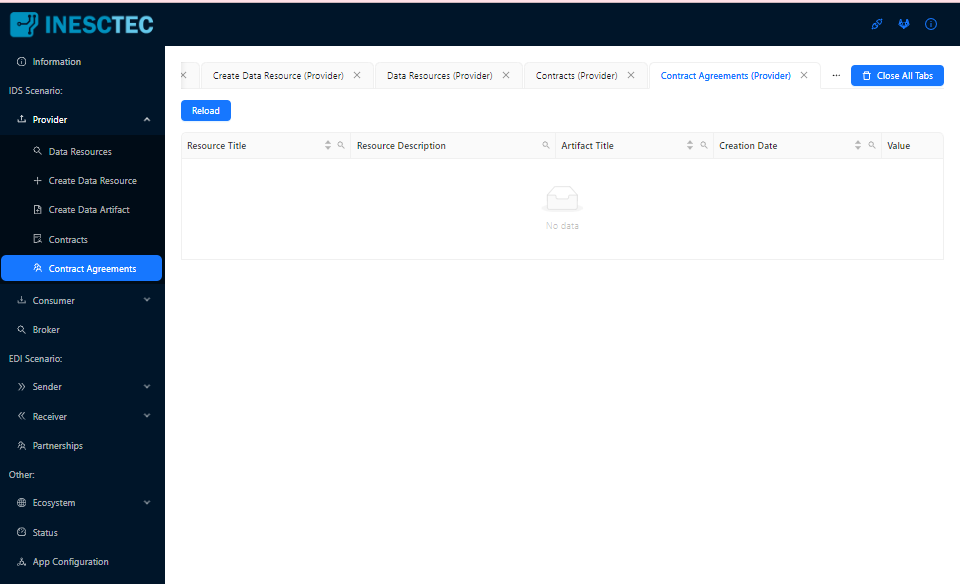
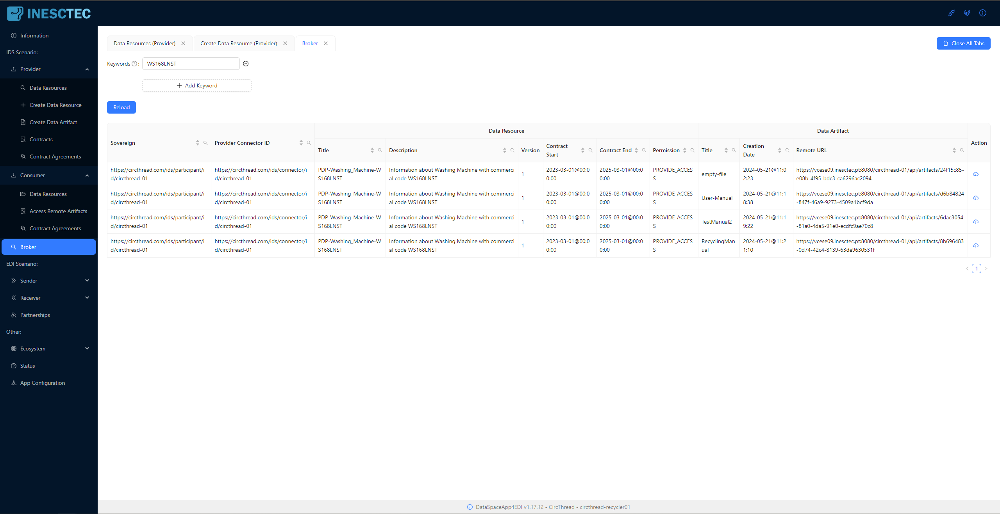
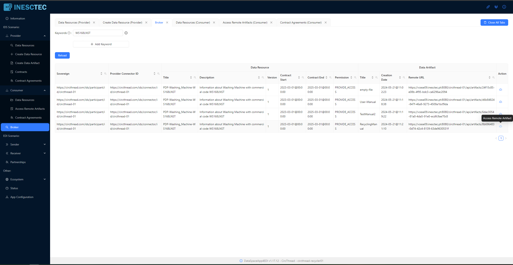

# Index

1. [Introduction](#1.Introduction)
2. [One Connector per Organization](#2.OneConnectorPerOrganization)
3. [Shared Connector mode](#3.SharedConnectorMode)
4. [Deployment](#4.Deployment)
5. [Using the DataSpaceApp4EDI througth REST interface](#5.Usage)
	1. [Basic concepts](#5.1Concepts)
	2. [Checking the configuration](#5.2Configuration)
	3. [Providing data](#5.3DataProvision)
	4. [Accessing remote data](#5.4DataAccess)
	5. [Consulting the MetadataBroker](#5.5MetadataBroker)
6. [Using the DataSpaceApp4EDI througth user interface](#6.Usage)
	1. [Providing data](#6.3DataProvision)
    2. [Consulting the MetadataBroker](#6.4.MetadataBroker)
    3. [Accessing remote data](#6.5DataAccess)
   

# 1. Introduction <a name="1.Introduction"></a>

The CircThread Connector constitutes the main instrument to enable the sharing/consumption of data in a virtual
environment (‘data space’) by information systems or human operators. In this context, several roles are identified, 
the one of 'Data Owner' (the entity that holds the sovereignty over a given data set), 
the one of 'Data User' (the entity that uses a given data set), and the ones of Data Provider and 
Data Consumer, roles assumed by IDS Connectors, with the responsibility of publishing data in the 
virtual space and, conversely, of providing controlled access to this same data. 
In the CircThread context, entities correspond to any type of organizations.

# 2. One Connector per Organization <a name="2.OneConnectorPerOrganization"></a>

When adopting the IDS technology, typically, an IDS Connector is defined for each entity. In the CircThread context, 
when there is provision and consumption of data between two information systems (ISa and ISb), there are two connectors (Ca and Cb), 
each associated with each IS. Thus, ISa is associated with Ca and ISb with Cb. Ideally, Ca should reside 
in the ISa ICT infrastructure and, likewise, Cb should reside in the ISb infrastructure. Data exchange between ISa and ISb are carried out by the associated Connectors, Ca and Cb. 

Please note that data exchange between any two ISs are carried out by Connectors associated with each IS in question 
(but there is only one Connector per entity, regardless of the number of entities with whom data exchange is done).

# 3. Shared Connector mode <a name="3.SharedConnectorMode"></a>
Regardless of the location where a Connector is hosted, having a Connector associated with each organization 
ends up being a bit restrictive and not very scalable in some contexts. 

The IDS reference model defines the role of “Service Provider”, assumed by ICT companies that provide software 
and/or services to participants (entities) in an IDS data space. It is expected that this ICT company will host 
the technical infrastructure that allows entities to participate in an IDS data space without having to 
install/host that same technical infrastructure (i.e. the Connector). 

A new functionality was introduced in version 1.16.0 of the Circthread Connector: the possibility of associating a 
Connector not with a single organization but with a group of organizations, having the Connector 
handling all data exchange to and from each of the entities in the group. This 'shared' operating mode 
allows one to deal with several situations: 1) the case of a single instance of an IS (Information System) being used by several 
organizations, in which we start to make use of a single IDS Connector responsible for exchanging data 
between these same organizations and any others available in the data space; 2) case of a portal, 
used by several entities without an IS, in which, equally, the exchange of data is ensured by the 
same Connector. 

However, the shared working mode should be applied only when the group of organizations is served by the 
same ICT company that provides them with software and/or services.

# 4. Deployment <a name="4.Deployment"></a>

This repository contains the Circthread Connector, which comprises the following components:
- IDS Dataspace Connector,
- DataSpaceApp4EDI,
- Postgres database
- haProxy

### Prerequisites:
- One machine running Ubuntu Server 20.04 LTS or Desktop 20.04 LTS with a public domain name 
(other versions of Linux may work but have not been tested).
- This machine must have a public host name or IP address.
- Port 8080 is the Connector's access point. This port must be exposed to the Internet.
- Port 8090 is the DataSpace4EDI's access point. This port must be exposed to the Internet.
- Java 21 must be installed on the machine.
- Docker and the Compose plugin must be installed on the machine (follow instructions below):
	- https://docs.docker.com/engine/install/ubuntu/#install-using-the-repository
	- https://docs.docker.com/engine/install/linux-postinstall/
	- https://docs.docker.com/compose/install/linux/#install-using-the-repository

### Step 1:  Download and unzip the distribution

```
wget https://github.com/CircThreadH2020/dataspace/-/raw/main/circthread-ids.zip
unzip circthread-ids.zip
cd circthread-ids
```

### Step 2: Set script permissions

```
chmod +x *.sh
```

### Step 3: Replace sensitive data fields

The strings you will need to replace are the following (see also the guidelines below):

| String                                       | Description                                                                                                         |
|----------------------------------------------|---------------------------------------------------------------------------------------------------------------------|
| `<REPLACE_WITH_CONNECTOR_MANAGER_UNIQUE_ID>` | This unique ID identifies the company responsible for managing the Circthread Connector.                            |
| `<REPLACE_WITH_ORG_UNIQUE_ID>`               | This unique ID identifies the organization that will be associated with the Circthread Connector.                   |
| `<REPLACE_WITH_ORG_UNIQUE_URI>`              | More complete representation of <REPLACE_WITH_ORG_UNIQUE_ID>.                                                       |
| `<REPLACE_DNS_CONNECTOR_IDS_ENDPOINT>`       | This is the domain name of the Connector component as seen from the Internet.                                       |
| `<REPLACE_WITH_IDS_UUID>`                    | This string is provided to you by INESC TEC.                                                                        |
| `<REPLACE_WITH_PUBLIC_KEY>`                  | This string is provided to you by INESC TEC.                                                                        |
| `<REPLACE_PASSWORD_1>`                       | This is the connector keystore password, provided to you by INESC TEC.                                              |
| `<REPLACE_PASSWORD_2>`                       | Choose a secure password. This is the REST API Interface password.                                                  |

We provide a script where you can choose the values for these strings and 
replace all the strings at once, in all the needed files of the distribution.

1. Open the `replace-vars.json` file, and replace each `replacement_value` instance with the value given to you, or chosen by you, i.e. 
`"<REPLACE_WITH_CONNECTOR_MANAGER_UNIQUE_ID>": "myOrganization"`. Make sure the information is correct and save the file before proceeding to the next step.
  
Guidelines for the first adopters of IDS technology in the Circthread project:
- Set `<REPLACE_WITH_CONNECTOR_MANAGER_UNIQUE_ID>` with the identifier of your organization
(request this identifier from INESC TEC).
- Set `<REPLACE_WITH_ORG_UNIQUE_ID>` with the identifier of the organization that will act as DataOwners/DataUsers. 
Use a simple String taken from the official name of the company.
- Set `<REPLACE_WITH_ORG_UNIQUE_URI>` with the identifier of the organization that will act as DataOwners/DataUsers.
It is a more complete identifier of `<REPLACE_WITH_ORG_UNIQUE_ID>` (request this identifier from INESC TEC).
- Set `<REPLACE_DNS_CONNECTOR_IDS_ENDPOINT>` with the public DNS or public IP address of the Linux system hosting the 
Connector.
- Request INESC TEC the values to assign to `<REPLACE_WITH_IDS_UUID>`, `<REPLACE_WITH_PUBLIC_KEY>`, `<REPLACE_PASSWORD_1>` and `<REPLACE_WITH_ORG_UNIQUE_URI>`.

Please send an email to INESC TEC (ana.c.chaves@inesctec.pt) requesting the registration of the Circthread Connector 
with the following items:
- Description of your organization: legalName, mnemonic, corporate email, corporate homepage, 
address of main site, fiscal id
- Contact point in your organization (person to be contacted about IDS related aspects): first and last name, 
email, phone number
- Identifier for `<REPLACE_WITH_ORG_UNIQUE_ID>`
- DNS or IP address of the computer system that will host the Connector 

2. Execute the script:

```
./replace-vars.sh
```

### Step 4: Add the IDS Certificate to the `connector-conf` directory

INESC TEC will provide you with this certificate. It is a file with name `ids.certificate.p12`. Put it on folder `./connector-conf` before proceeding.

### Step 5: Create the app4edi keystore

Execute the script:

```
./create-certs.sh
```

The script will create certificates for the haproxy and app4edi components, using the IDS certificate provided by INESC TEC. 
Please note that the IDS certificate ensures the digital identity of the Connector in the ecosystem and it is 
related with the domain name or IP address that you have previously sent to INESC TEC, prior to the creation of the 
IDS certificate (please make sure that your host machine has that domain name or IP address).  

As we are also using the IDS certificate on the SSL connections to the haproxy and app4edi services, 
you will get a security warning whenever you try accessing the REST API through a browser. You can either 
ignore this warning or, if you want, you can request a real certificate for your host machine created by a 
trusted Certificate Authority. If you opt for the latter, please contact INESC TEC team to inform you of the necessary changes.

### Step 6: Now run the distribution

```
./start.sh
```

*Note: The script will take about a minute to fully execute*

To stop the Circthread Connector, simply use the script:

```
./stop.sh
```

*Note: There is a 'reset.sh' script that will stop down the Connector, delete 
any data generated by the Connector, clear the DataBase and start again the Connector.*

### Step 7: Check that the solution started properly

```
docker compose logs -f circthread-app4edi
```
You should get an output like the following one where the last lines say that:<br>
'*Tomcat started on port(s): 8090 (https) 8085 (http) with context path '/[app_context_path]'
Started DataSpaceApp4EDI in 34.917 seconds (process running for 37.297)*'


### Step 8: Access the Swagger user interface

Go to an Internet browser and insert the link of the Circthread Connector:
```
https://....:8090/<REPLACE_WITH_CONNECTOR_MANAGER_UNIQUE_ID>/swagger-ui.html
```

Logging requires that you supply: as username the contents of <REPLACE_WITH_ORG_UNIQUE_ID>
and as password the contents of <REPLACE_PASSWORD_2>.

# 5. Using the DataSpaceApp4EDI througth REST interface <a name="5.Usage"></a>

The DataSpaceApp4EDI provides a swagger-based interface that describes the REST-based API of the App whilst allowing you to manually interact with it. As shown below, the swagger-based interface is organized in 8 sections.

To access the swagger interface, go to `https://<REPLACE_DNS>:8090/<REPLACE_WITH_ORG_UNIQUE_ID>/swagger-ui.html` and fill in the login details. The username is `<REPLACE_WITH_ORG_UNIQUE_ID>` and the password is the one you configured earlier with `<REPLACE_PASSWORD_2>`. If you have trouble accessing the URL above, try clearing your browser's cache.

**The DataSpaceApp4EDI is an extension of the IDS DataspaceConnector. This means that an instance of the DataspaceApp4EDI is always connected with a DataspaceConnector.**

This document aims to show you how to:

 - **provide data throught the connected IDS Connector**
 - **access remote data provided by a remote IDS Connector running in the same ecosystem.** 


For data provision and consumption, you should use sections 3, 4 and 5 of the API:


## 5.1. Basic Concepts <a name="5.1Concepts"></a>

The scenario described in this chapter is the 'General sovereign data sharing scenario'. First, documents are published by an entity along with the definition of a data usage policy. Then, entities with permission to find these documents (that is, after accepting the data usage policy), will be able to access these documents, in the form of a contract that is agreed between the two parties.

The following identify the basic concepts:

 - A Data Resource is a set of Artifacts that you create and publish.
 - An Artifact is a data file that you publish under a Data Resouce in order to enable Data Consumers in the ecosystem to access it.
 - Each Artifact has an URL (publicUrl) that is used by a Data Consumer to start acessing the Artifact.
 - Acess to an Artifact is subject to the acceptance of a Contract. The Contract is defined by the Data Provider during the creation of a Data Resource.
 - The Contract specifies the following permissions: PROVIDE_ACCESS, USAGE_DURING_INTERVAL, USAGE_UNTIL_DELETION, DURATION_USAGE, USAGE_LOGGING, USAGE_NOTIFICATION, N_TIMES_USAGE.

## 5.2. Checking the configuration <a name="5.2Configuration"></a>

Check if the DataSpaceApp4EDI's configuration matches the configuration you specified in the deployment of the solution:


## 5.3. Providing data <a name="5.3DataProvision"></a>

The provision of data involves the creation of an element (called Data Resource) and the upload of data files (called Artifacts) into it.

**Step 1:** Go to the 'Data Resources - provider side' section in the swagger interface.

**Step 2:** Open the first POST endpoint ('/api/data-resources-provided':


**Step 3:** Click 'Try it out' on the right hand side and set the body with the following content, replacing the necessary fields with your desired Data Resource metadata:

    {
		"title": "PDP-P20230303",
		"descr": "Information about product P20230303",
		"keywords": [
			"term1",
			"term2"
		],
		"license": "http://url-for-the-license/",
		"standard": "http://url-for-standard-used/",
		"endpointDocumentation": "https://url-for-technical-doc/",
		"keyValueSet": {
			"key1": "value1",
			"key2": "value2"
		},
		"contracts": [
			{
				"title": "PDP-P20230303;public_access",
				"start": "2023-03-01T00:00:00Z",
				"end": "2025-03-01T00:00:00Z",
				"consumer": "",
				"usagePolicies": [
					{
						"type": "PROVIDE_ACCESS"
					}
				]
			}
		]
	}


**Step 4:** Press the 'Execute' button. You should get the following:


**Step 5:** Open the **'GET /api/data-resources-provided/{dataResourceTitle}'** endpoint and verify that the Data Resource was created by inserting the 'dataResourceTitle' and executing the request.

**Step 6:** Open the **'POST /api/data-resource-provider/{dataResourceTitle}/artifacts'** endpoint and insert the title of the Data Resource and the title of the data file (Artifact) you want to upload. You’ll also need to use the ‘Choose file’ button to select the file you want to upload.  Now press the 'Execute' button.
Please note that the field 'artifactIsDynamic', if set to true, is an indication to the system that the artifact to be published may be changed afterwards. Each such change will trigger a mechanism through which the Data Provider notifies each registered Data Consumer about that change. On the Data Consumer, the last version of the artifact will be accessible without any user intervention.


After executing, you should get information describing the artifact that has just been created. Look at the field ‘artifactPublicUrl’. This is the http link that will allow another Connector in the ecosystem to access the data file.


**Step 7:** Open the **'GET /api/data-resources-provided/{dataResourceTitle}/artifacts/{artifactTitle}/data' endpoint** and verify that the Data Resource was created by inserting the 'dataResourceTitle' and 'artifactTitle' and executing the request. You’ll get a response from the DataSpaceApp4EDI with a file to be downloaded. This enables you to retrieve the data file from the DataSpaceApp4EDI:


## 5.4. Accessing remote data <a name="5.4DataAccess"></a>

In order to access a data file (artifact) being provided by an IDS Connector in the ecosystem (i.e. by a Data Provider) you should know its public URL ('artifactUrl'). You’ll need it in this section.

**Step 1:** Go to the 'Data Resources - consumer side' section in the swagger interface.

**Step 2:** Open the **'POST /api/data-resources-consumed/artifacts’** endpoint, set the  'artifactUrl' field and press the 'Execute' button. After some time, the time needed by the local IDS connector to contact the remote IDS Connector and to accept its contractual terms (in the example above the contract states that any Connector can access the Artifact), the DataSpaceApp4EDI returns the following response where the ‘Download file’ button enables you to access the downloaded file:


Attention, by doing the above action, you are accepting the terms and conditions, as declared by the Data Provider / Data Owner in the description of the Data Resource holding the Artifact you are asking for.

As you proceed with accessing remote artifacts from IDS Connectors, you can access the complete list of them in the **‘GET /api/data-resources-consumed’** endpoint:


If you need to access any of the contracted artifacts, you can open the **‘GET /api/data-resources-consumed/artifacts/artifact-url’** endpoint and have access to the description of the artifact. Alternatively, you can open the **‘GET /api/data-resources-consumed/artifacts/artifact-url/data’** endpoint and have access to the artifacts' contents by downloading the artifact into your computer (for both endpoints you must supply the 'artifactUrl').

## 5.5. Consulting the MetadataBroker <a name="5.5MetadataBroker"></a>

In order to access a data file (artifact) being provided by an IDS Connector you should know its public URL. If you don’t know it you will have access the IDS MetadataBroker. This section shows you how you can do it.

**Step 1:** Open the **‘GET /api/data-resources-on-broker’** on the 'Data Resources - on Broker' section of the swagger interface. If you execute the request without entering a search term you’ll possibly get a long list of the Artifacts that are registered in the Metadata Broker. Instead of that, introduce a search term like the one in the image below and execute the request. The DataSpaceApp4EDI will return a list of all the artifacts registered in the Broker that contain that search term (you can use more than one search term):


In the list above, copy the last term, the URL, (something like ‘https://vcese19.inesctec.pt:4567/connectors/1512659989/-1093253542/82161677’). Open the **'GET /api/data-resources-on-broker'**, and introduce that term in the field ‘offer’. Execute the request and the DataSpaceApp4EDI will return more information about the selected artifact:

 - Its title and description, the type of permission, the name of the artifact, and its URL (the URL you will use to access the data file). By using this URL and going throught the steps described in the previous section, you will have access to the corresponding Artifact.


# 6. Using the DataSpaceApp4EDI througth user interface <a name="6.Usage"></a>

The DataSpaceApp4EDI provides also a proper user interface aiming human operators. Naturally, it is more user friendly than the swagger based interface (described in the above chapter). The functions and information provided by the interface are essentially the same as the ones seen in the swagger based interface.

To access the user interface, go to `https://<REPLACE_DNS>:8090/<REPLACE_WITH_ORG_UNIQUE_ID>` and fill in the login details. The username is `<REPLACE_WITH_ORG_UNIQUE_ID>` and the password is the one you configured earlier with `<REPLACE_PASSWORD_2>`. If you have trouble accessing the URL above, try clearing your browser's cache.

For data provision and consumption, you should use the _IDS Scenario_:


## 6.3. Providing data <a name="6.3DataProvision"></a>

The provision of data involves the creation of an element (called Data Resource) and the upload of data files (called Artifacts) into it.

**Step 1:** Go to the 'Provider' > 'Create Data Resource' section 

A Data Resource is the main element for data sharing. It always has a Data Contract and Data Usage policies associated. Additionally, all files to be shared are under a data resource.
The title and description are mandatory but other fields like keywords and licences are optional. They should be used when, for instance, the information to be shared follows a standard or needs a licence to be used. The keywords are important for visibility when a consumer is searching for datasets in a catalogue.

The other mandatory element is the Contract, which is comprised of at least one policy, or it can be comprised of a combination of multiple usage policies. A policy is an organization’s rule that may be either an obligation, a permission or a prohibition:




**Step 2:** Create an Artefact under the selected Data Resource

The artefacts are the files or information sets and are always associated with a given Data Resource. The UI provides two methods to create the artefacts: create it from the Data Resource Menu (as shown in the following picture) or go directly to the “_Create Data Artifacts_” on the left-hand side. The latter involves the writing of the Data Resource title while the first already has some information pre-loaded.
An artefact is considered dynamic when it allows for versions. This means that the provider can update the file and each consumer (if they exist) will automatically receive a file update.



**List all Contracts created**

Additionally, all Contracts created by the provider can be seen on the menu _Contracts_. It also shows all rules (i.e., usage policies) associated with each contract.




**List all contract agreements**

The provider can use the menu _Contract Agreements_ to see all contracts where an agreement was achieved by a consumer.




## 6.4. Consulting the MetadataBroker <a name="6.4.MetadataBroker"></a>

**Search in the Broker**

When registering a Data Resource and Artifact on the dataspace their metadata will be registered on the IDS Metadata Broker, which is a catalogue of all active connectors and their data.

**Note:** The _Remote URL_ is the public URL of the document, and it will be the value used to download the artefact.



## 6.5. Accessing remote data <a name="6.5DataAccess"></a>

In order to access a data file (artifact) being provided by an IDS Connector in the ecosystem (i.e. by a Data Provider) you should know its public URL ('artifactUrl'). You’ll need it in this section.

**Step 1:** Search the Broker

**Step 2:** Access document

To consume an artefact, it is necessary to know its remote URL. 
The UI provides two ways of doing this. First (as shown in the next figure), press the “Access Remote Artefact” on the Broker section. 
Secondly, manually copy the “Remote URL” value and then go to the _Consumer_ tab on the left-side menu, choose “Access Remote Artifacts” and past the value.



Attention, by doing the above action, you are accepting the terms and conditions, as declared by the Data Provider / Data Owner in the description of the Data Resource holding the Artifact you are asking for.
