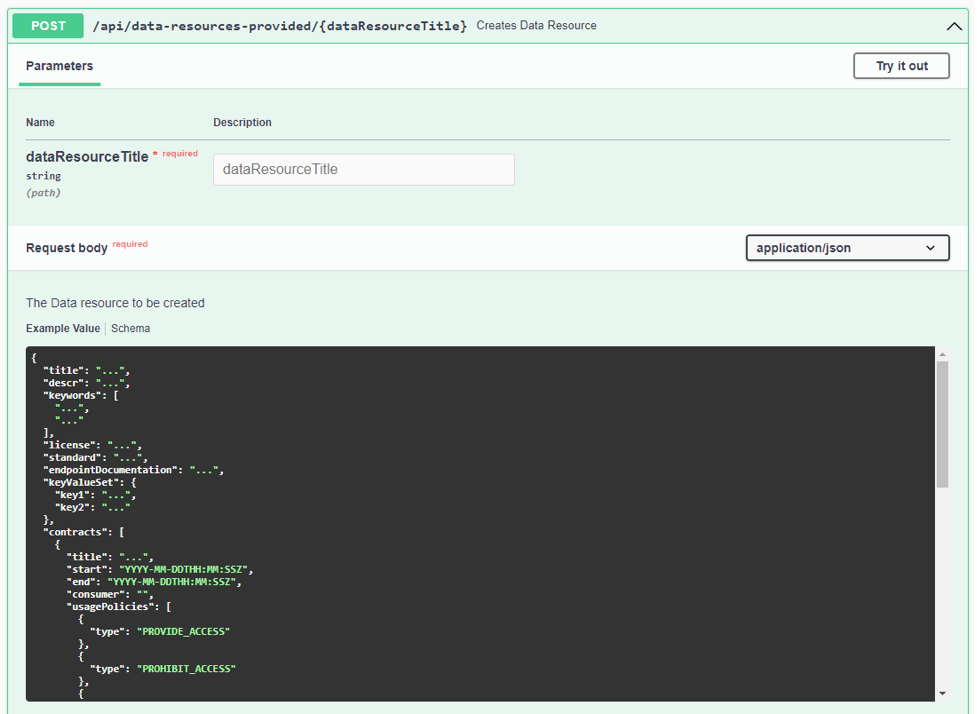

# Index

1. [Deployment](#1.Deployment)
2. [Using the Data-Space-App](#2.Usage)
	1. [Basic concepts](#2.1Concepts)
	2. [Checking the configuration](#2.2Configuration)
	3. [Providing data](#2.3DataProvision)
	4. [Accessing remote data](#2.4DataAccess)
	5. [Consulting the MetadataBroker](#2.5MetadataBroker)


# 1. Deployment <a name="1.Deployment"></a>

### Prerequisites:
- One machine running Ubuntu Server (more advanced) or Desktop 20.04 with a public domain name (other versions may work but have not been thoroughly tested).
- This machine must have preferably a public host name or IP address.
- Port 8080 is the Connector's access point. This port must be exposed to the Internet.
- Port 8090 is the DataSpace4Edi's access point. This port must be exposed to the Internet.
- Java 17 must be installed on the machine.
- Docker and the Compose plugin must be installed on the machine (follow instructions below):
	- https://docs.docker.com/engine/install/ubuntu/#install-using-the-repository
	- https://docs.docker.com/engine/install/linux-postinstall/
	- https://docs.docker.com/compose/install/linux/#install-using-the-repository

### Step 1:  Download and unzip the distribution

```
wget https://gitlab.inesctec.pt/ids/dataspace-4circthread/-/raw/main/circthread-ids.zip
unzip circthread-ids.zip
cd circthread-ids
```

### Step 2: Set script permissions

```
chmod +x *.sh
```


### Step 3: Replace sensitive data fields

The strings you will need to replace are the following:
| String | Description |
|--|--|
| `<REPLACE_WITH_ORG_UNIQUE_ID>` | This organization's unique ID is the one INESC TEC used when creating your connector. |
| `<REPLACE_DNS>` | This is the domain name of your machine (this may be simply the IP address of your host machine). |
| `<REPLACE_WITH_IDS_UUID>` | This string is provided to you by INESC TEC. |
| `<REPLACE_WITH_PUBLIC_KEY>` | This string is provided to you by INESC TEC. |
| `<REPLACE_PASSWORD_1>` | This is the connector keystore password, provided to you by INESC TEC. |
| `<REPLACE_PASSWORD_2>` | Choose a secure password. This is the REST API Interface password. |
| `<REPLACE_WITH_CATALOG_TITLE>` | Choose a title for the Catalog that will hold the Data Resources that will be published. |
| `<REPLACE_WITH_CATALOG_DESCRIPTION>` | Choose a description for the Catalog. |


We provide a script where you can choose the values for these strings and replace all the strings at once, in all the needed files.

1. Open the `replace-vars.json` file, and replace each `replacement_value` instance with the value given to you, or chosen by you, i.e. `"<REPLACE_WITH_ORG_UNIQUE_ID>": "myOrganization"`. Make sure the information is correct and save the file before proceeding to the next step.

Please send an email to INESC TEC (ana.c.chaves@inesctec.pt) requesting the registration of the CircThread Connector
with the following items (you can also fulfill the form [Participant Registration Template.docx](Participant%20Registration%20Template.docx)):

* Description of your organization: legalName, mnemonic, corporate email, corporate homepage,
address of main site, fiscal id
* Contact point in your organization (person to be contacted about IDS related aspects): first and last name,
email, phone number
Identifiers for <REPLACE_WITH_ORG1_UNIQUE_ID> and <REPLACE_WITH_ORG2_UNIQUE_ID>

DNS or IP address of the computer system that will host the Connector (or localhost if you can't have a public IP address)

2. Execute the script:

    	./replace-vars.sh


### Step 4: Add the IDS Certificate to the `connector-conf` directory

INESC TEC will provide you with this certificate. It is a `.p12` file.
Put it on folder `./connector-conf` before proceeding.

### Step 5: Create the app4edi keystore

Execute the script:

    ./create-certs.sh

The script will create certificates for the haproxy and app4edi services, using the IDS certificate provided by INESC TEC. Please note that the IDS certificate ensures the digital identity of the Connector in the ecosystem and it is related with the domain name or IP address that you have previously sent to INESC TEC, prior to the creation of the IDS certificate (please make sure that your host machine has that domain name or IP address).  

As we are also using the IDS certificate on the SSL connections to the haproxy and app4edi services, you will get a security warning whenever you try accessing the REST API through a browser. You can either ignore this warning or, if you want, you can request a real certificate for your host machine created by a trusted Certificate Authority. If you opt for the latter, please contact INESC TEC team to inform you of the necessary changes.

### Step 6: Now run the distribution

```
./start.sh
```
*Note: The script will take about a minute to fully execute*

To stop the CircThread Connector, simply use the script:
```
./stop.sh
```

*Note: There is a 'reset.sh' script that will stop down the Connector, delete
any data generated by the Connector, clear the DataBase and start again the Connector.*

### Step 7: Check that the solution started properly
```
docker compose logs -f circthread-app4edi
```
You should get an output like the following one where the last lines say that:<br>
'*Tomcat started on port(s): 8090 (https) 8085 (http) with context path '/[app_context_path]'
Started DataSpaceApp4Edi in 34.917 seconds (process running for 37.297)*'


# 2. Using the Data-Space-App <a name="2.Usage"></a>

The user interface of the DataSpaceApp (formely known as DataSpaceApp4EDI) is a swagger-based interface that describes the REST-based API of the App whilst allowing you to manually interact with it. As shown below, the user interface is organized in 8 sections.

To access the swagger interface, go to `https://<REPLACE_DNS>:8090/<REPLACE_WITH_ORG_UNIQUE_ID>/swagger-ui.html` and fill in the login details. The username is `<REPLACE_WITH_ORG_UNIQUE_ID>` and the password is the one you configured earlier with `<REPLACE_PASSWORD_2>`. If you have trouble accessing the URL above, try clearing your browser's cache.

**The DataSpaceApp is an extension of the IDS DataspaceConnector. This means that an instance of the DataspaceApp4EDI is always connected with a DataspaceConnector.**

This document aims to show you how to:

 - **provide data throught the connected IDS Connector**
 - **access remote data provided by a remote IDS Connector running in the same ecosystem.** 


For data provision and consumption, you should use sections 3, 4 and 5 of the API:


## 2.1. Basic Concepts <a name="2.1Concepts"></a>

 - A Data Resource is a set of Artifacts that you create and publish.
 - An Artifact is a data file that you publish under a Data Resouce in order to enable Data Consumers in the ecosystem to access it.
 - Each Artifact has an URL (publicUrl) that is used by a Data Consumer to start acessing the Artifact.
 - Acess to an Artifact is subject to the acceptance of a Contract. The Contract is defined by the Data Provider during the creation of a Data Resource.
 - The Contract specifies the following permissions: PROVIDE_ACCESS, USAGE_DURING_INTERVAL, USAGE_UNTIL_DELETION, DURATION_USAGE, USAGE_LOGGING, USAGE_NOTIFICATION, N_TIMES_USAGE.


## 2.2. Checking the configuration <a name="2.2Configuration"></a>

Check if the App’s configuration matches the configuration you specified in the deployment of the solution:


## 2.3. Providing data <a name="2.3DataProvision"></a>

The provision of data involves the creation of an element (called Data Resource) and the upload of data files (called Artifacts) to it.

**Step 1:** Go to the 'Data Resources - provider side' section in the swagger interface.

**Step 2:** Open the first POST endpoint:



**Step 3:** Click 'Try it out' on the right hand side, set the 'dataResourceTitle' field and set the body with the following content, replacing the necessary fields with your desired Data Resource metadata:

    {
		"title": "PDP-P20230303",
		"descr": "Information about product P20230303",
		"keywords": [
			"term1",
			"term2"
		],
		"license": "http://url-for-the-license/",
		"standard": "http://url-for-standard-used/",
		"endpointDocumentation": "https://url-for-technical-doc/",
		"keyValueSet": {
			"key1": "value1",
			"key2": "value2"
		},
		"contracts": [
			{
				"title": "PDP-P20230303 ; public access",
				"start": "2023-03-01T00:00:00Z",
				"end": "2025-03-01T00:00:00Z",
				"consumer": "",
				"usagePolicies": [
					{
						"type": "PROVIDE_ACCESS"
					}
				]
			}
		]
	}


**Step 4:** Press the 'Execute' button. You should get the following:


**Step 5:** Open the **'GET /api/data-resources-provided'** endpoint and verify that the Data Resource was created by inserting the 'dataResourceTitle' and executing the request.

**Step 6:** Open the **'POST /api/data-resource-provider/{dataResourceTitle}/artifacts'** endpoint and insert the title of the Data Resource and the title of the data file (artifact) you want to upload. You’ll also need to use the ‘Choose file’ button to select the file you want to upload.  Now press the 'Execute' button.
Please note that the field 'artifactIsDynamic', if set to true, is an indication to the system that the artifact to be published may be changed afterwards. Each such change will trigger a mechanism through which the Data Provider notifies each registered Data Consumer about that change. On the Data Consumer, the last version of the artifact will be accessible without any user intervention.


After executing, you should get information describing the artifact that has just been created. Look at the field ‘artifactPublicUrl’. This is the http link that will allow another Connector in the ecosystem to access the data file.


**Step 7:** Open the **'GET /api/data-resources-provided/{dataResourceTitle}/artifacts/{artifactTitle}/data' endpoint** and verify that the Data Resource was created by inserting the 'dataResourceTitle' and 'artifactTitle' and executing the request. You’ll get a response from the App with a file to be downloaded. This enables you to retrieve the data file from the App:


## 2.4. Accessing remote data <a name="2.4DataAccess"></a>

In order to access a data file (artifact) being provided by an IDS Connector you should know its public URL. You’ll need it in this section.

**Step 1:** Go to the 'Data Resources - consumer side' section in the swagger interface.

**Step 2:** Open the **'POST /api/data-resources-consumed/artifacts’** endpoint, set the  'artifactUrl' field and press the 'Execute' button. After some time, the time needed to contact the remote IDS Connector and to accept its contractual terms (in the example the contract states that any Connector has access to the Artifact), the App returns the following response where the ‘Download file’ button enables you to access the downloaded file:


As you proceed with accessing remote artifacts from IDS Connectors, you can access the complete list of them in the **‘GET /api/data-resources-consumed’** endpoint:


If you need to access any of the contracted artifacts, you can open the **‘GET /api/data-resources-consumed/{dataResourceTitle}/artifacts/{artifactTitle}/data’** endpoint and download it to your computer (you’ll need to set the fields ‘dataResourceTitle’ and ‘artifactTitle’).

## 2.5. Consulting the MetadataBroker <a name="2.5MetadataBroker"></a>

In order to access a Data file (artifact) being provided by an IDS Connector you should know its public URL. If you don’t know it you may access the IDS MetadataBroker. This section shows you how you can do it.

**Step 1:** Open the **‘GET /api/data-resources-on-broker’**. If you execute the request without entering a search term you’ll possibly get a long list of the Artifacts that are registered in the MetadataBroker. Instead, introduce a search term like the one in the image below and execute the request. The App will return a list of all the artifacts registered in the Broker that contain that search term (you can use more than one search term):


In the list above, copy the last term, the URL, (something like ‘https://vcese19.inesctec.pt:4567/connectors/1512659989/-1093253542/82161677’). Open the **'GET /api/data-resources-on-broker'**, and introduce that term in the field ‘offer’. Execute the request and the App will return more information about the selected artifact:

 - Its title and description, the type of permission, the name of the artifact, and its URL (the URL you will use to access the data file).


